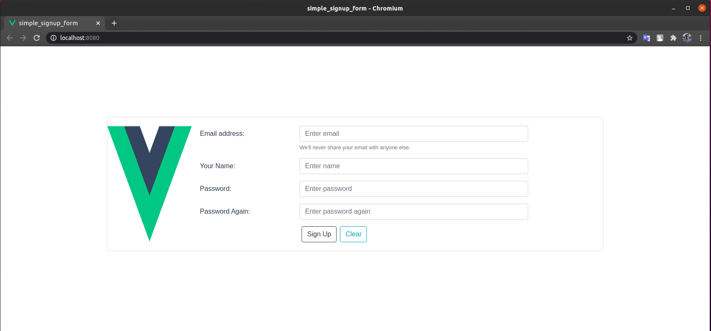
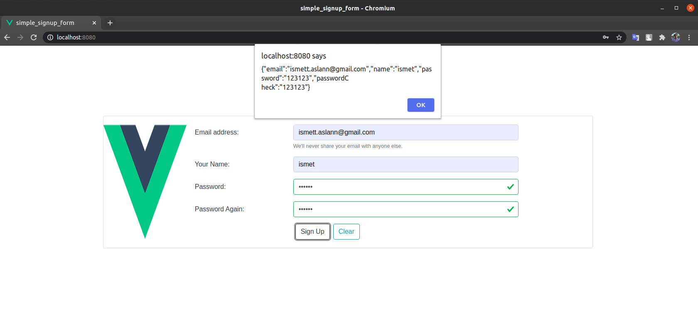
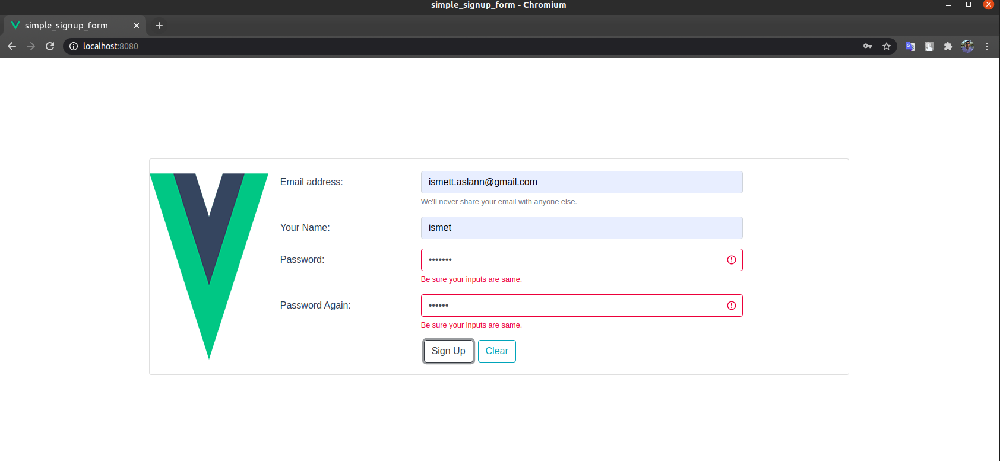

# simple_signup_form
http://ismetarslann.wordpress.com/ sitesi için hazırlanan demodur.

Uygulamanın çalışması için bilgisayarınızda aşağıdakilerin kurulu olması gerekli;

- VueJS

Uygulamayı klonladıktan sonra VueJS tarafının ayağa kalkması için aşağıdaki adımları izleyebilirsiniz;

Terminalden uygulamanın klonlandığı dizin içerisine gittikten sonra aşağıdaki komutu çalıştırın;


```bash

 npm run serve
 
```

Bu komuttan sonra aşağıdaki gibi bir görüntü ile karşılaşmanız gerekmekte. 
**Herhangi bir hata aldığınız durumda package-lock.json dosyasını silip tekrar komutu çalıştırmayı deneyebilirsiniz.



## Ekran Görüntüleri






